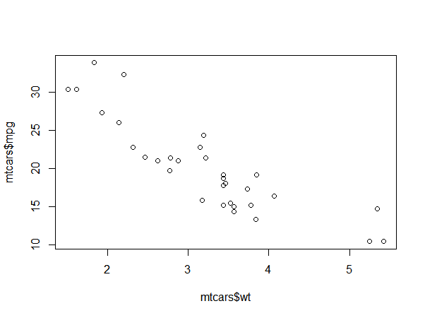

# Results

```{r include=FALSE}
library(tidyverse)
library(kableExtra)
```


## Main results

And here is an example table of regression coefficients in Table \@ref(tab:mtreg).

```{r mtreg}
mod <- lm(mpg ~ wt, data = mtcars)
coefcis <- cbind(coef(mod), confint.default(mod))
colnames(coefcis) <-
  c("Estimate", "95% CI lower limit", "95% CI upper limit")
knitr::kable(coefcis,
             digits = 2,
             booktabs = TRUE,
             caption = "Parameter estimates from regression of mpg on weight.") %>%
  kable_styling(latex_options = c("HOLD_position"))
```

Example text example text example text example text example text example text example text example text example text example text example text example text example text example text example text example text example text example text.

An example of a figure is shown in Figure \@ref(fig:pressure).
```{r pressure, fig.cap='An example figure.', fig.align='center', out.width='75%', fig.pos="H"}
plot(pressure, pch = 19, type = "b")
```

And we can include image files directly, such as Figure \@ref(fig:knitlogo).
```{r knitlogo, fig.cap='Another example figure.', fig.align='center', out.width='75%'}

```

To figure code chunks add the chunk option `fig.pos="H"` to use the LaTeX float package to try and position the figure where the code appears.

Also, this is how to reference a section, e.g. the Introduction was chapter \@ref(introduction) and the Literature Review was section \@ref(literature-review).